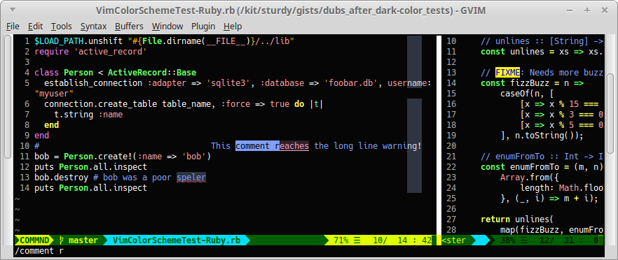

##################################
Dubs Vim |em_dash| Dubs After Dark
##################################

.. |em_dash| unicode:: 0x2014 .. em dash

Vibrant white and light text on a black background.

*The Dubs After Dark color scheme and* `Dubs Mescaline <https://github.com/landonb/dubs_mescaline>`__ *status line.*

About This Plugin
=================

This plugin provides an opinionated negative polarity color scheme.

The highlights are mostly Vim defaults, with a few tweaks to
improve contrast, provoke vibrancy, and increase readability.

Basically, if you clear highlights and start fresh, e.g.,:

.. code-block:: vim

  highlight clear
  set background=dark
  set termguicolors
  highlight Normal gui=NONE guifg=White guibg=#060606 ctermfg=White ctermbg=none

This plugin makes the following tweaks:

- Searches (i.e., started with ``/``, ``*``, or Dubs' ``<F1>``)
  are highlighted with a light pink background and underline.

- Spelling mistakes are highlighted with a light grey background
  and a red undercurl.

- The ``ColorColumn`` is set to light grey.

- The background is set to almost black, #060606, which you can
  easily override by setting ``g:dubs_after_dark_background``
  before loading the color.

- Less distracting dark grey line numbers (Vim's default is deep red)
  that work well either a light background or a dark background.

- Remove the distracting vertical bar between split windows.

- And more! Your best bet is to install the plugin, load the color,
  and see if you like it.::

  :color after-dark

The Dubs After Dark color works well the compelling
`Dubs Appearance <https://github.com/landonb/dubs_appearance>`__
plugin, which adjusts other parts of the look and feel of Vim.
<Shameless self-plug.>

For another excellent light-on-dark (though not black) color scheme,
check out
`jellybeans.vim <https://github.com/nanotech/jellybeans.vim>`__.

Installation
============

Installation is easy using the packages feature (see ``:help packages``).

To install the package so that it will automatically load on Vim startup,
use a ``start`` directory, e.g.,

.. code-block:: bash

    mkdir -p ~/.vim/pack/landonb/start
    cd ~/.vim/pack/landonb/start

If you want to test the package first, make it optional instead
(see ``:help pack-add``):

.. code-block:: bash

    mkdir -p ~/.vim/pack/landonb/opt
    cd ~/.vim/pack/landonb/opt

Clone the project to the desired path:

.. code-block:: bash

    git clone https://github.com/landonb/dubs_after_dark.git

If you installed to the optional path, tell Vim to load the package:

.. code-block:: vim

   :packadd! dubs_after_dark

Just once, tell Vim to build the online help:

.. code-block:: vim

   :Helptags

Then whenever you want to reference the help from Vim, run:

.. code-block:: vim

   :help dubs-after-dark

